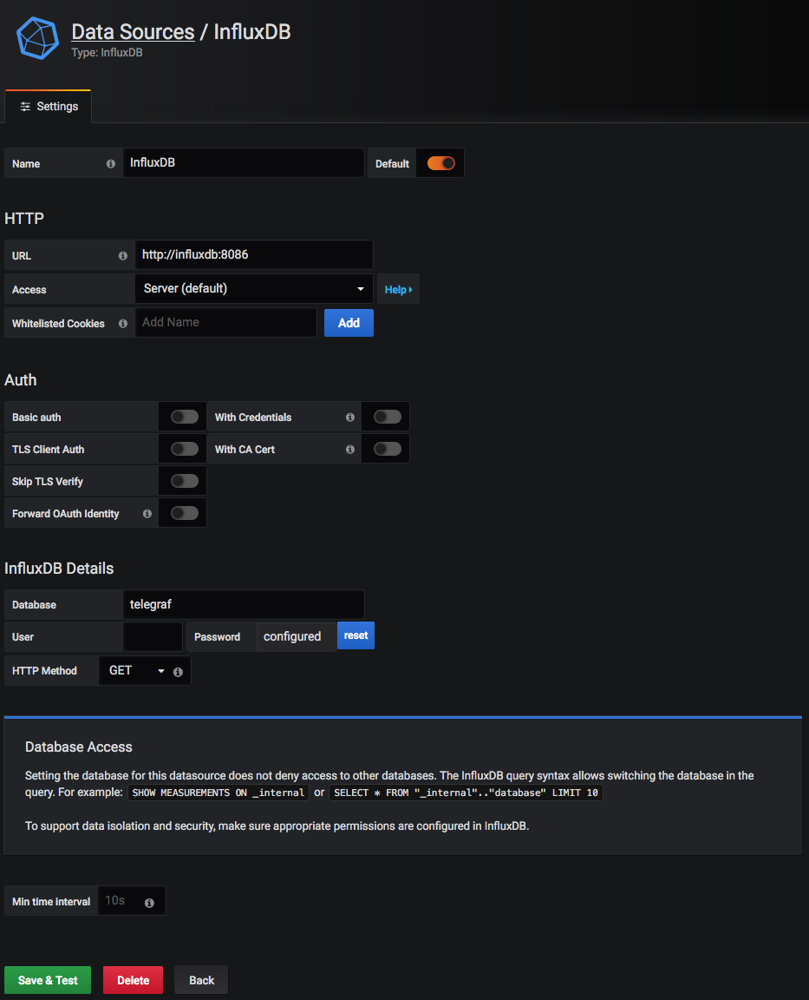

# Visualizing Oracle performance data with InfluxDB und Grafana #


With Active Session History (ASH), Oracle provides an invaluable feature to historically analyze performance. Implemented as a ring buffer, data retention is limited.
But often, one needs to be able to analyze the database load retrospectively for a longer period of time.
Archiving the ASH data into some other storage comes to mind. Modern monitoring/visualization solutions like the ELK stack (Elasticsearch, Logstash, Kibana) or the TICK-Stack (Telegraf, InfluxDB, Chronograf, Kapacitor) come to mind. One solution using the ELK stack is described by Robin Moffat at https://www.elastic.co/de/blog/visualising-oracle-performance-data-with-the-elastic-stack.

## Introduction

This tutorial will show how to use the TICK stack, or more precisely its storage component InfluxDB. Covering all aspects of InfluxDB is way outside the scope of this article, we will cover just what we need as we go. If you are totally new to InfluxDB or want to dig deeper, please refer to the very good online documentation https://docs.influxdata.com/influxdb/v1.7/
You should however have a rough idea of the key concepts https://docs.influxdata.com/influxdb/v1.7/concepts/key_concepts/.
If you have an SQL database background, the crosswalk https://docs.influxdata.com/influxdb/v1.7/concepts/crosswalk/ might be helpful, too

Also, this tutorial will make use of Docker in order to setup the test/demo environment, so make sure you have Docker installed and you have sufficient permissions to create containers.

Before we dig into it I just want to point out that the ASH is part of the "Oracle Diagnostics Pack" and needs to be licensed properly.

## Setting up the test environment

Let us begin by going ahead and installing influxdb and grafana. To keep things simple, we just use the official docker images and use the following commands to spin up  our test environment.
```bash
docker run -d -p 127.0.0.1:8086:8086  --name influxdb influxdb:1.7.9
docker run -d -p 127.0.0.1:3000:3000 --link influxdb --name grafana grafana/grafana:6.4.4
```

## Getting the ASH data into InfluxDB

We are ready now for the next step - gathering ASH data and feeding them into InfluxDB.  
As a so called "time series database", InfluxDB manages "points" (in time), identified by timestamp, measurement name (like "cpu_load") and "tags".

### Enter telegraf

Time to look at the "T" in "TICK" stack, Telegraf, which is the TICK stack's data collector. Telegraf supports a variety of output-plugins (one of them InfluxDB), and also lots and lots of input-plugins. Among them a couple of plugins to collect performance data from various databases - except Oracle. Even a simple query against Oracle is not possible. Looks like we need to roll our own.

Luckily, Telegraf has a plugin called "exec" which executes arbitrary commands and captures the output, which can then be fed into InfluxDB.
With that being said, we use a small python script to query the ASH and transform the data into a format suitable for InfluxDB.

```python
import script_here
```


Next thing we need is an Oracle-User, which the script will use to access ASH:
```
sqlplus connect / as sysdba

SQL> create user metrics identified by metrics;

User created.

SQL> grant connect to metrics;

Grant succeeded.

SQL> grant select on v_$active_session_history to metrics;
```

Now we need to edit the provided telegraf.conf to point to our script, and then execute telegraf

```bash
telegraf --config telegraf.conf --debug
```
The --debug switch enables more verbose logging, so we will see right away if anything is wrong.

If everything went ok, InfluxDB is now being fed with ASH data. Let's check!
There should be a database called "telegraf" containing measurement with the name "oracle_ash" now.

```
$ docker exec -ti influxdb /usr/bin/influx
Connected to http://localhost:8086 version 1.7.9
InfluxDB shell version: 1.7.9
> use telegraf
Using database telegraf
> show measurements
name: measurements
name
----
oracle_ash

```

## Grafana

Next thing we need is to set up a data source in Grafana, like shown.




We are ready now to create our first Graph. Grafana already has a fresh dashboard with a new, unconfigured panel. Click on "add Query", and we can enter our query using the query editor, like shown in the screenshot.


The demo dashboard shows wait events, session status(waiting/running), number of blocking sessions and sessions blocked by other sessions and by which wait event.


## Conclusion
Collecting Oracle performance data in InfluxDB makes it easy to visualize what happens on your database, even for historical data. Having you application also feed performance data into InfluxDB even makes you able to correlate them to Oracle's and troubleshoot performance with only a few clicks. 


Oracle's Active Session History (ASH) ist unerlässlich, um die Performance der Datenbank auch historisch auswerten zu können. Allerdings ist die ASH als Ringpuffer ausgeführt, und damit die Vorhaltezeit der historischen Performancedaten begrenzt. Oft ist es aber gerade wichtig, das Verhalten der Datenbank rückwirkend für einen längeren Zeitraum unter die Lupe zu nehmen.

Dementsprechend müssen die Daten also anderweitig persistiert werden. Einen Ansatz können moderne Monitoring- bzw. Visualisierungs-Lösungen wie der ELK-Stack (Elasticsearch, Logstash, Kibana) und der TICK-Stack (Telegraf, InfluxDB, Chronograf, Kapacitor) bieten.
Einen Weg, wie man den ELK-Stack hierzu nutzen kann, zeigt Robin Moffatt unter https://www.elastic.co/de/blog/visualising-oracle-performance-data-with-the-elastic-stack

In dieses Tutorial soll die Verwendung des TICK-Stack erklären, von dem uns zunächst nur dessen Storage-Kompenente InfluxDB interessiert.

Vorab noch die obligatorische Anmerkung, dass die Active Session History Teil des "Oracle Diagnostics Pack" ist und damit entsprechend lizenzpflichtig. Es gibt aber auch die Möglichkeit, ohne die ASH ans Ziel zu kommen, dazu später mehr.

InfluxDB und Elasticsearch verfolgen verschiedene Ziele. Während Elasticsearch insbesondere als Such-Engine einsetzbar ist, ist InfluxDB eine sogenannte "Time-Series-Database", und damit eher für das Verwalten von Metriken zu bestimmten Zeitpunkten interessant. Auch die Vorhaltezeit der Daten läßt sich durch Anlegen von Retention Policies einfach konfigurieren.
Anders als eine RDBMS "denkt" InfluxDB nicht in Tabellen, Keys und Indizes, sondern in "Points", die durch Tags identifiziert werden, Felder enthalten und in sogenannten Measurements abgelegt werden. InfluxDB ist zudem schemalos.

Zunächst müssen wir uns InfluxDB und Grafana installieren. Der Einfachheit halber verwenden wir Docker und die offiziellen Docker-Images:
```bash
docker run -d -p 127.0.0.1:8086:8086  --name influxdb influxdb:1.7.9
docker run -d -p 3000:3000 --link influxdb --name grafana grafana/grafana:6.4.4
```
Wie bekommen wir nun die Daten aus der ASH in die InfluxDB? Der Datensammler im TICK-Stack nennt sich Telegraf, und bietet von Haus aus eine Reihe von Plugins zum Sammeln der verschiedensten Metriken einschließlich Performancedaten einiger Datenbanken wie MySQL, Postgres oder SQL Server, jedoch nicht Oracle. Auch einfach nur Queries gegen Oracle absetzen ist nicht möglich. Es gibt aber das "exec"-Plugin, mit dem sich beliebige Programme oder Skripte ausführen lassen, deren Ausgabe dann InfluxDB zugeführt wird. Diesen Weg wollen wir gehen. Zum Aufbereiten der Daten verwenden wir ein kleines Python-Script.


```python
import script_here
```


Jetzt brauchen wir noch einen Oracle-User, mit dem das Script auf die Active Session History zugreifen kann.
Oracle User anlegen:
```
sqlplus connect / as sysdba

SQL> create user metrics identified by metrics;

User created.

SQL> grant connect to metrics;

Grant succeeded.

SQL> grant select on v_$active_session_history to metrics;
```


```bash
telegraf --config telegraf.conf
```

Jetzt, da InfluxDB aus der Active Session History befüllt wird, können wir mit dem Visualisierungsteil weitermachen.
Grafana ist auf http://localhost:3000 erreichbar und möchte nach Login mit admin/admin zunächst ein neues Passwort gesetzt haben.

Als nächstes benötigen wir eine Datenquelle.


Und jetzt endlich erstellen wir unseren ersten Graphen. Grafana hält bereits ein frisches Dashboard und ein neues, unkonfiguriertes Panel für uns bereit.
Ein Klick auf "Add Query", und wir können mit dem Query Editor eine Abfrage erstellen, wie z. B. für die Wait Events, siehe Screenshot.


Die Oracle Active Session History enthält natürlich noch viel mehr nützliche Informationen, von denen im Rahmen dieses Tutorials nur ein paar behandelt werden können, um den Rahmen nicht zu sprengen.
Aus der Oracle Active Session History können auf diese Weise eine Reihe von Performancedaten visualisiert werden. Sammelt man nun noch weitere Metriken der laufenden Applikation und Systeme ebenfalls in InfluxDB, lassen sich diese mit den Daten aus der ASH korrelieren. Das Identifizieren von Performanceproblemen wird damit zum Klacks.

Das Demo-Dashboard zeigt die Wait-Events, den Session-Status(wartend/laufend), sowie die Anzahl blockierender Sessions und welche Sessions durch welche anderen Sessions und durch welches Wait-Event blockiert werden.


